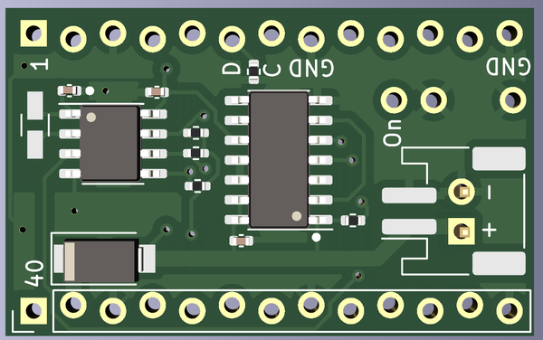
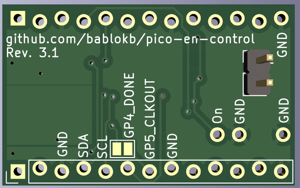
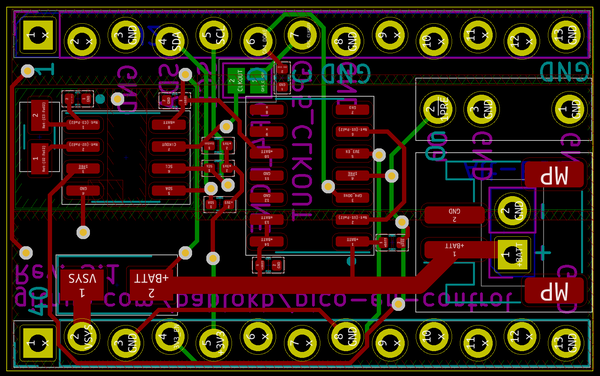
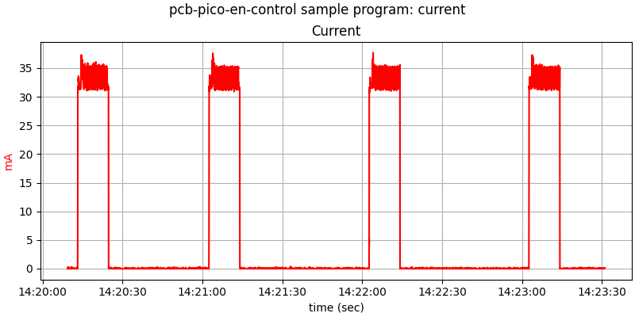

Pico EN Control
===============

This is a simple circuit to control the enable pin of a Pico to 
minimize battery usage.

Functions:
  * Enable using a button, a RTC or an external signal
  * Disable by pulling a GPIO high from your program
  * keep time

The target application of this design is a program that runs in
intervals. After startup the program executes it's tasks, sets
the next wakup time and then pulls the "done"-GPIO high.
The circuitry then pulls the enable-pin low, thus limiting the
battery consumption to a very low level.

Hardware Components
-------------------

A D-type flip-flop drives the enable pin of the Pico. A
button, the RTC or an external signal will reset the flip-flop,
which pulls the enable pin high.

The "done"-pin of the Pico is connected to the CLK-pin of
the flip-flop. A rising edge will toggle the enable pin.

PCB
---

PCB design files are in `pico-en-control.kicad`.

Ready to use production files for JLCPCB are in `production_files`.

The design of the breakout allows it to be connected directly on the bottom
side of the pico. Note that the breakout uses a solderless layout for the
pins, i.e. it will hold by friction. But don't expect miracles, it may
or may not work depending on your pins. For production use, you should
definitely solder the breakout. 

Software
--------

A simple example program implemented in CircuitPython
is provided in `src/main.py`. The software provides some boilerplate
code for timer and alarm-based wake up.

In timer-mode, the program uses the countdown-timer of the rtc. It
blinks the on-board LED for ten seconds, then goes to sleep for 15 seconds.

Measured current:

For longer intervals alarm-based wake up is more suitable. Since the rtc
does not support seconds for alarms, it will always fire on "full minutes".
The current measurement demonstrates this behavior (the first off-interval
is shorter than the following off-intervals):

License
-------

[![CC BY-SA 4.0][cc-by-sa-shield]][cc-by-sa]

This work is licensed under a
[Creative Commons Attribution-ShareAlike 4.0 International
License][cc-by-sa].

[![CC BY-SA 4.0][cc-by-sa-image]][cc-by-sa]

[cc-by-sa]: http://creativecommons.org/licenses/by-sa/4.0/
[cc-by-sa-image]: https://licensebuttons.net/l/by-sa/4.0/88x31.png
[cc-by-sa-shield]:
https://img.shields.io/badge/License-CC%20BY--SA%204.0-lightgrey.svg
